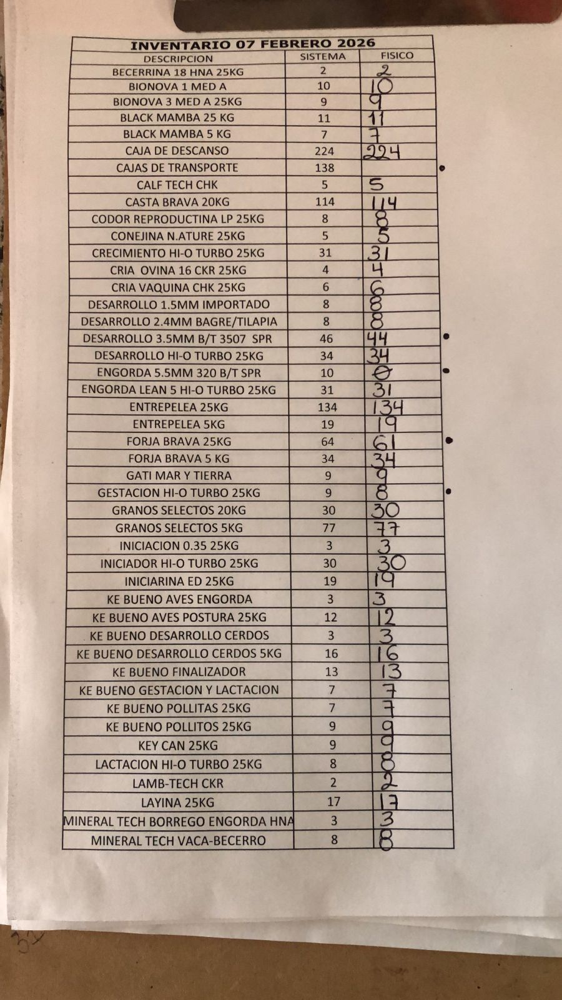

# MÓDULO 02 — Organización y Personas
## NVC — Nutrición, Vacunas y Consultoría

---

<!-- DIAPOSITIVA 1: PORTADA MÓDULO -->
# Tema: Organización | Diapositiva 1
## Estructura Organizacional y Funciones por Puesto



**Versión 1.1 | Abril 2026**

> *"Una empresa sin estructura es una empresa que depende de personas, no de sistemas."*

---

<!-- DIAPOSITIVA 2: ORGANIGRAMA ACTUAL -->
# Tema: Organización | Diapositiva 2
## Organigrama actual

```
                    DIRECTOR GENERAL
                       (Ignacio)
                           │
         ┌─────────────────┼─────────────────┐
         │                 │                 │
  ÁREA ADMINISTRATIVA  ÁREA COMERCIAL    ÁREA TÉCNICA
     (Vianey)          (por crear)       (por crear)
         │                 │                 │
    Rossy (Aux.       Encargados        Promotor Técnico
    Admin.)           Sucursales        (por contratar)
    Bodegueros        Promotor ventas   Equipo vacunación
                      (por contratar)
```

**Niveles jerárquicos:** N1 (DG) → N2 (Gerentes) → N3 (Encargados) → N4 (Operativos) → N5 (Apoyo)

---

<!-- DIAPOSITIVA 3: ORGANIGRAMA OBJETIVO -->
# Tema: Organización | Diapositiva 3
## Organigrama objetivo — A 12 meses

```
                    DIRECTOR GENERAL
                       (Ignacio)
                           │
         ┌─────────────────┼─────────────────┐
         │                 │                 │
  GERENTE             GERENTE           GERENTE
  ADMINISTRATIVO      COMERCIAL         TÉCNICO
    (Vianey)          (por designar)    (por contratar)
         │                 │                 │
  Auxiliar Admin.    Encargados x5     Promotor Técnico
  (Rossy)           Promotores        Técnicos Vacunadores
  Auxiliar Contable  Vendedores ruta   Consultor Técnico
  (por evaluar)      Repartidores
```

---

<!-- DIAPOSITIVA 4: PUESTO — DIRECTOR GENERAL -->
# Tema: Funciones | Diapositiva 4
## Director General — Ignacio

| | |
|---|---|
| **Objetivo** | Dirigir la empresa hacia su crecimiento sostenible |
| **Reporta a** | Socios / Familia |
| **Supervisa** | Gerentes de área |

**Funciones clave:**
- Define la visión y estrategia del negocio
- Aprueba inversiones y contrataciones
- Gestiona relación con Purina y proveedores estratégicos
- Supervisa KPIs consolidados (dashboard semanal)
- Toma decisiones de apertura de nuevas sucursales

**KPI principal:** Rentabilidad neta mensual por sucursal

> ⚠️ **Hoy:** El DG también hace operaciones (ventas, logística, compras). Este rol debe **delegarse progresivamente**.

---

<!-- DIAPOSITIVA 5: PUESTO — GERENTE ADMINISTRATIVO -->
# Tema: Funciones | Diapositiva 5
## Gerente Administrativo — Vianey

| | |
|---|---|
| **Objetivo** | Controlar todas las operaciones financieras, administrativas y de RRHH |
| **Nivel** | N2 |
| **Reporta a** | Director General |
| **Supervisa** | Rossy (Aux. Admin.), Bodegueros, personal general |

**Funciones confirmadas (entrevista 05/04/2026):**

| Área | Funciones |
|------|-----------|
| **Finanzas** | Administra dinero, conciliación bancaria mensual, verifica cortes y transferencias, va al banco |
| **Compras** | Ingresa compras, gestiona pedidos a proveedores, reportes al contador |
| **Inventario** | Ajusta inventario en sistema, gestiona mermas, pasa info al DG |
| **RRHH** | Responsable del personal, altas/bajas IMSS, nómina |
| **Control** | Administra políticas, MyBusiness Pro básico, custodia documentos |

---

<!-- DIAPOSITIVA 6: PUESTO — AUXILIAR ADMINISTRATIVO -->
# Tema: Funciones | Diapositiva 6
## Auxiliar Administrativo — Rossy

| | |
|---|---|
| **Objetivo** | Apoyar a Vianey en funciones financieras, inventario y pedidos |
| **Nivel** | N4 |
| **Reporta a** | Gerente Administrativo (Vianey) |

> **Nota:** En febrero 2026 Rossy desempeñaba funciones de cajera. Para abril 2026 su rol evolucionó a auxiliar administrativo de Vianey.

**Funciones actuales:**

| Área | Funciones |
|------|-----------|
| **Cobranza** | Pagos cuentas a crédito, verificar bajas de notas, gestión de cobranza |
| **Compras** | Pedidos a Purina, seguimiento de órdenes |
| **Inventario** | Inventario físico, traspasos entre sucursales en sistema |
| **Facturación** | Emisión de CFDI |
| **Reportes** | Reportes diarios al grupo de WhatsApp, estatus cobranza |

---

<!-- DIAPOSITIVA 7: OTROS PUESTOS CLAVE -->
# Tema: Funciones | Diapositiva 7
## Otros puestos clave

| Puesto | Titular | Función principal | KPI |
|--------|---------|-------------------|-----|
| **Encargado Sucursal** | Paola / Briseida | Supervisar operación diaria, reportar corte, manejar personal | Ventas diarias, diferencia en caja |
| **Cajero/a** | Por confirmar en cada sucursal | Registrar ventas, cobrar, corte de caja | Diferencia en corte: $0 |
| **Bodeguero** | José Galván / Álvaro | Carga/descarga, inventario físico, orden | Exactitud de inventario |
| **Promotor de Ventas** | Pepe, Julio | Visitas a clientes, levantamiento de pedidos | Pedidos/semana, clientes nuevos |
| **Técnico Vacunador** | 2 personas | Vacunación en campo, protocolo sanitario | Vacunas aplicadas, incidentes |

---

<!-- DIAPOSITIVA 8: PLANTA DE PERSONAL -->
# Tema: Organización | Diapositiva 8
## Planta de personal — Estado actual

| # | Nombre | Puesto | Sucursal | Antigüedad |
|---|--------|--------|----------|------------|
| 1 | Ignacio | Director General | Matriz | Fundador |
| 2 | Vianey | Gerente Administrativa | Apatzingán | 8 años |
| 3 | Rossy | Auxiliar Administrativo | Apatzingán | 1 año |
| 4 | José Galván | Bodeguero | Apatzingán | 4 años |
| 5 | Álvaro | Bodeguero | Apatzingán | 3 años |
| 6 | Rebeca | Concentración de info. | Apatzingán | 1 año |
| 7 | Pepe | Vendedor en ruta | Apatzingán | — |
| 8 | Paola | Encargada | San Simón | — |
| 9 | Gustavo | Promotor Técnico | San Simón | — |
| 10 | Técnico Vacunador | — | San Simón | — |
| 11 | Briseida | Encargada | Nueva Italia | — |
| 12 | Julio (DG Jr.) | Ventas/Marketing | Nueva Italia | — |
| 13 | Técnico Vacunador | — | Nueva Italia | — |
| 14 | + 1 pendiente confirmar | — | — | — |

---

<!-- DIAPOSITIVA 9: BRECHA — HOY VS OBJETIVO -->
# Tema: Organización | Diapositiva 9
## Brechas de estructura — Hoy vs Objetivo

| Elemento | Hoy | Objetivo 12 meses |
|----------|-----|-------------------|
| Organigrama formal | ❌ No existe | ✅ Validado y publicado |
| Manual de funciones | ⚠️ Borrador | ✅ Operativo y firmado |
| Política de RRHH | ❌ No documentada | ✅ Reglamento interno |
| IMSS del personal | ❌ Mayoría sin | ✅ 100% regularizado |
| Estructura administrativa | 1 sola persona (Vianey) | ✅ Vianey + Aux Contable + Rossy |
| Gerencias formales | ❌ Ninguna | ✅ Admin + Comercial + Técnica |
| Encargados de sucursal | ⚠️ Informales | ✅ Con funciones y KPIs definidos |

---

<!-- DIAPOSITIVA 10: DEPENDENCIA DE PERSONAS -->
# Tema: Organización | Diapositiva 10
## El riesgo más grande: dependencia de personas

> **Si mañana Vianey no pudiera venir, ¿quién sabe hacer qué?**

| Función crítica | Persona que la sabe | ¿Está documentado? |
|----------------|--------------------|--------------------|
| Conciliación bancaria | Vianey | ⚠️ Solo en v1.1 del manual |
| Pedidos a Purina | Rossy | ⚠️ Solo en v1.1 del manual |
| Acceso a MyBusiness (admin) | Vianey + técnico AnyDesk | ❌ No documentado |
| Facturación | Rossy | ⚠️ Solo en v1.1 |
| Cortes y transferencias | Vianey | ❌ No documentado como proceso |

**Acción:** Documentar procedimientos paso a paso para cada función crítica → SOP (Standard Operating Procedures)

---
*NVC — Módulo 02: Organización y Personas | Confidencial | Abril 2026*
